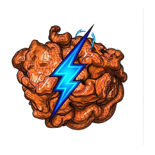
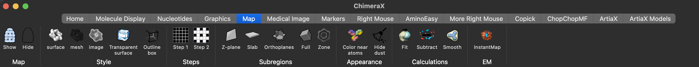
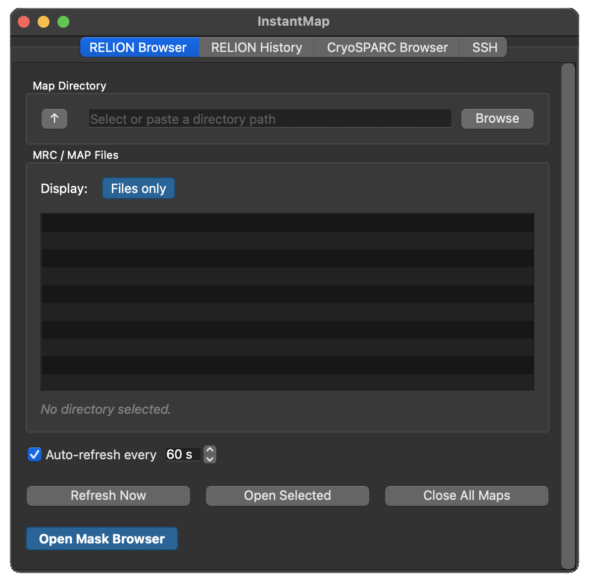
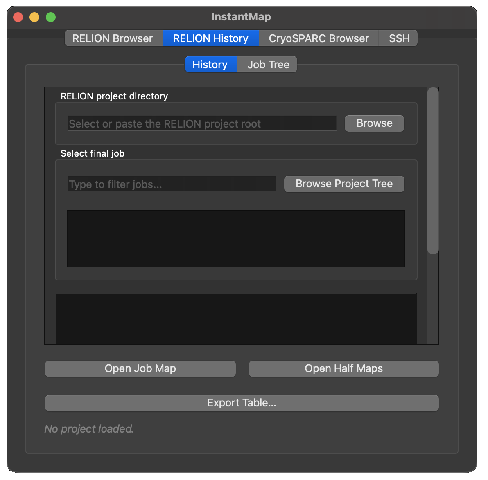
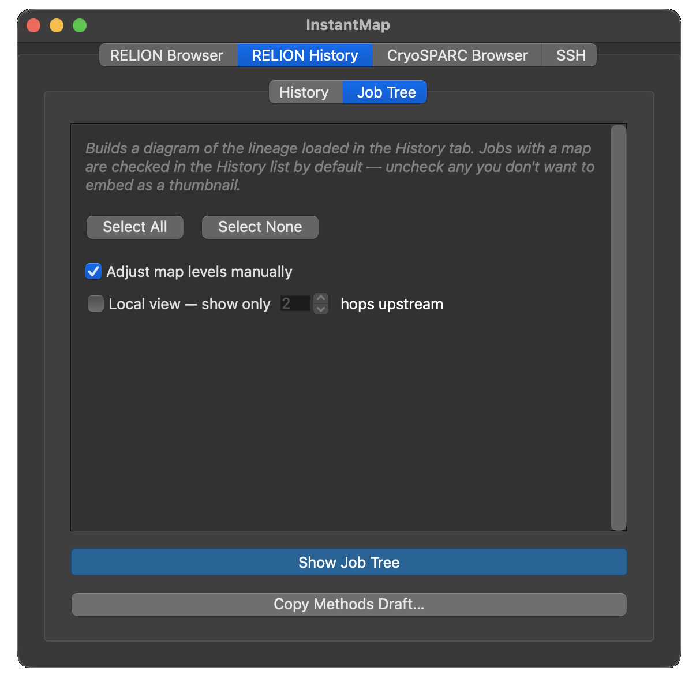
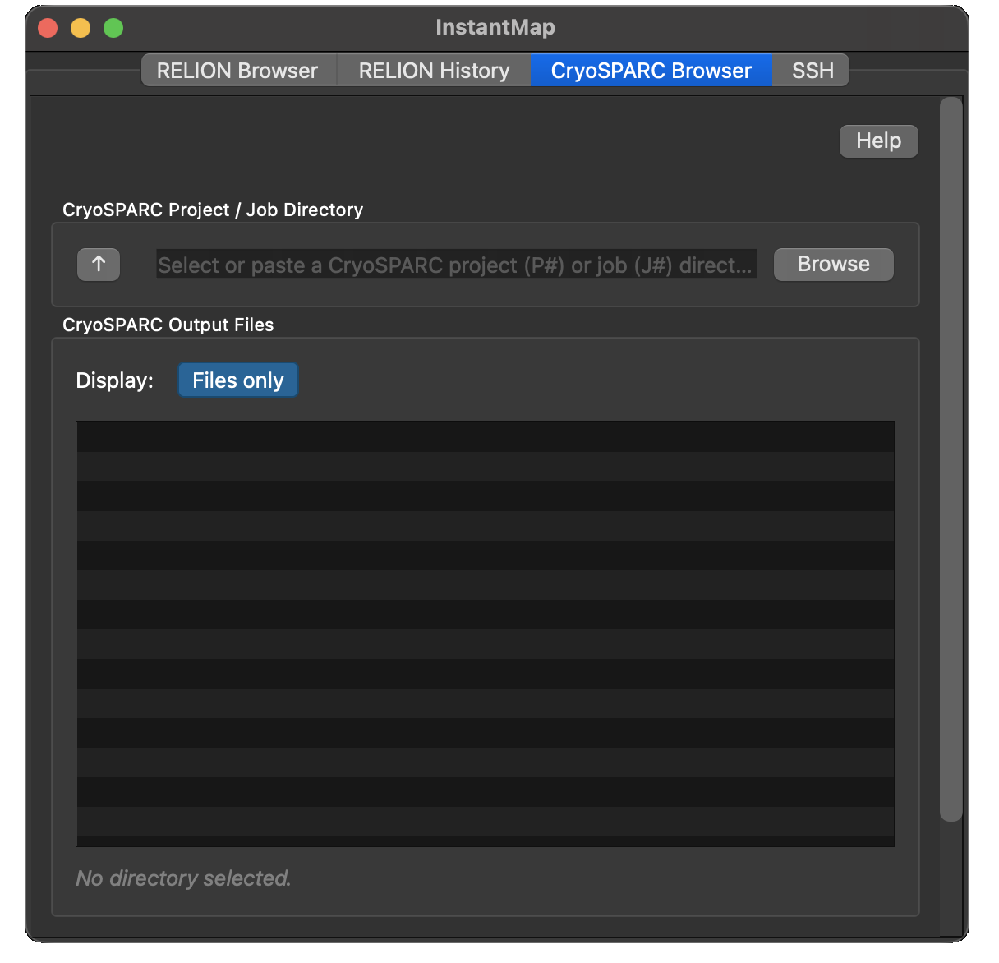
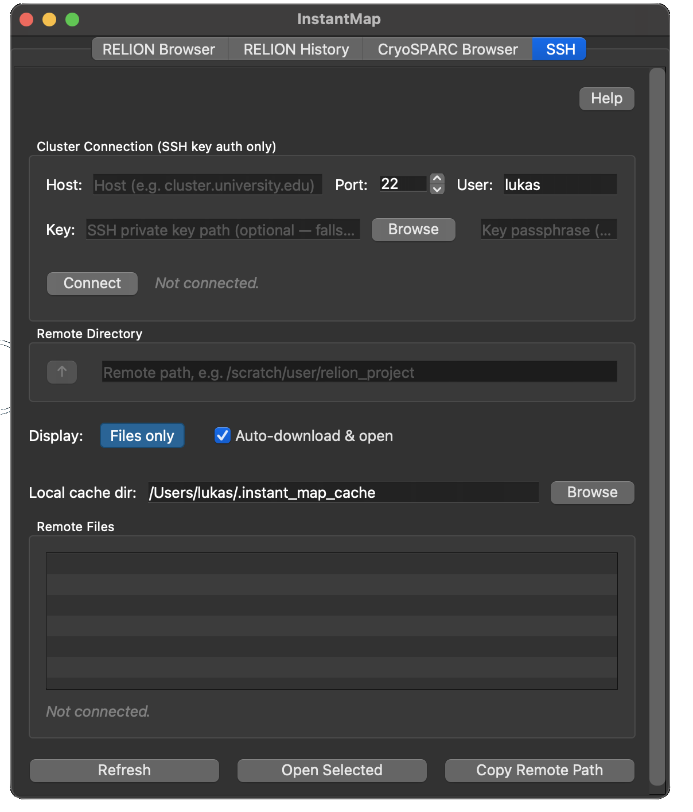

<p align="center">
  
</p>

# InstantMap

Tired of manually refreshing your classification or refinement directories in ChimeraX? InstantMap
watches a directory for new MRC/MAP files and keeps the list up to date automatically — locally, on
a CryoSPARC project, or over SSH on a remote cluster — so the latest iteration map is always one
click away.

## Finding it in ChimeraX

Once installed, InstantMap adds a button in the **EM** section of ChimeraX's **Map** toolbar tab:



You can also open it via **Tools → Volume Data → InstantMap**, or from the command line:

```
ui tool show "InstantMap"
```

## The tool panel

The tool docks as a side panel with four tabs: **RELION Browser**, **RELION History**, **CryoSPARC
Browser**, and **SSH**. It opens at a comfortable size and each tab scrolls independently if its
content doesn't fit — the panel can still be resized smaller at any time.

## RELION Browser



The **Map Browser** watches a directory for `.mrc`, `.mrcs`, `.mrc.gz`, `.map`, and `.map.gz` files:

1. Click **Browse** or paste a path into the directory field.
2. The file list populates and **auto-refreshes** every 60 seconds by default — change the interval
   (5–600 s) or uncheck **Auto-refresh every** to turn it off. **Refresh Now** forces an immediate
   update.
3. With **"Files only"** active, subdirectories show at the top — click **▶** to expand them, or
   double-click to navigate in. Switch to **"+ Folders"** to hide subdirectories entirely.
4. **Double-click** a file to open it, or select several and click **Open Selected**. Already-opened
   files are shown in grey italic. **Close All Maps** closes every open volume at once.

Click **Open Mask Browser** to reveal a second, independent panel for mask files — same navigation,
but no auto-refresh (masks don't change between iterations). Hide it again to give the map browser
more room.

!!! tip "Typical workflow"
    Set the active refinement job (e.g. `Refine3D/job003/`) as the Map Directory — new
    `*_class*.mrc` / `*_half*.mrc` files appear automatically as iterations complete. Set your
    `Masks/` folder as the Mask Directory and browse to the right mask when needed.

## RELION History



The tab has two sub-tabs, **History** (day-to-day browsing) and **Job Tree** (figure export).

### History

1. Browse to or paste the RELION project root — the folder containing `default_pipeline.star`; the
   newest job's history loads automatically.
2. Type in the filter box to narrow the job list (RELION numbers jobs globally, so it's sorted
   newest first), or click any job to load its history — or click **Browse Project Tree** to pick a job
   from a tree diagram of the whole project instead.
3. The complete upstream lineage appears in chronological order: job number, color-coded job type,
   and parent job(s).
4. Each job is tagged with its **state** (`succeeded`/`running`/`failed`/`aborted`/`unknown`, read
   from RELION's own `RELION_JOB_EXIT_*` sentinel files) and its **output artifacts**
   (postprocess/map, half-maps, mask). Each job also has a checkbox — checked by default when it
   has a map — controlling which jobs get a thumbnail in the Job Tree diagram.
5. Select a job and click **Open Job Map** (postprocess map if present, otherwise the latest
   refine/class map) or **Open Half Maps** to load its outputs directly.
6. **Export Table…** writes the loaded lineage as a CSV or Markdown table (job, type, state,
   parent(s), resolution, particle count) — for a methods section or supplementary material.

Useful for tracing which classification or selection led to a given refinement.

### Job Tree



!!! tip "Job Tree diagram"
    Click **Show Job Tree** to open a popup with a top-to-bottom card diagram of the lineage,
    styled after CryoSPARC's own tree/card views: rounded cards connected by orthogonal
    (horizontal/vertical only) lines, family-colored headers (job name plus a resolution/
    particle-count caption when available) with a state dot, and jobs with a map showing it as a
    transparent-background thumbnail (or a **grid of thumbnails** for a Class3D job with several
    classes). **Select All**/**Select None** toggle which jobs from the History checkboxes get
    rendered; **Local view: N hops** limits the diagram to jobs within N upstream steps of the
    selected job instead of the full lineage, once a project's history gets long.

    - **Mask volumes render as a mesh** at an explicit level of 0.5 (the standard threshold for
      RELION's normalized 0-1 masks) instead of a solid surface at the auto-picked level, which is
      otherwise a flat blob or nearly invisible.
    - If a Class3D job's classes feed into a later job that only carried one of them forward (a
      RELION "Select classes"/Subset selection job, or a job naming one class as its own
      reference), that one class gets a **dashed border** in the thumbnail grid so it's clear
      which class was actually used downstream, rather than the whole card.
    - **"Adjust map levels manually"** (on by default, toggle it off for the faster automatic
      path) shows each map with a live-updating preview and a level slider before its thumbnail
      is captured — useful for masks and other volumes that render solid black at ChimeraX's
      automatic level. **Skip this map** excludes it entirely. A level you set is remembered per
      map file and pre-fills the slider next time.
    - Export as **PNG**, **PDF**, or **SVG**; the vector formats keep cards, lines, and text as
      separate objects, editable in Illustrator or Inkscape, ready for a figure.
    - **Copy Methods Draft…** assembles a short, editable per-job text draft from the lineage's
      own recorded parameters and stats — a starting point for a methods section.

    In **Browse Project Tree**, the job you currently have loaded is highlighted — thicker,
    accent-colored cards and connectors — among the full project graph, showing which branch fed
    into it alongside any other/abandoned jobs.

    All of the above (tree/table/methods draft) is also scriptable — see
    [Command line](cli.md) for building them from ChimeraX's command line or any terminal, without
    opening this panel at all.

## CryoSPARC Browser



Point it at a CryoSPARC project (`P#`) or job (`J#`) directory on disk — same navigation as the
RELION Browser. This is filesystem-only: the directory needs to be mounted/reachable locally, no
CryoSPARC login or network access involved.

Volumes (including sharpened/filtered/raw variants), half-maps, masks, and `.bild`
viewing-direction files are recognized and tagged by filename. Double-click or **Open Selected** to
load a file (`.bild` files use ChimeraX's native BILD reader); **Copy Path** copies the selected
path(s) to the clipboard. Auto-refresh is available here too (off by default).

## SSH — browsing a remote cluster



For when a RELION/CryoSPARC project isn't reachable through a local mount or VPN path, the SSH tab
browses it directly over SFTP. **Key-based auth only** — no passwords are ever used or stored.

### One-time setup: creating a dedicated SSH key

!!! tip "Use a dedicated key"
    You don't have to reuse your everyday SSH key — a separate key just for InstantMap is easy to
    set up and easy to revoke later without touching anything else.

1. **Make sure `paramiko` is installed.** It's declared as a bundle dependency, so a normal Toolshed
   install/update should already have it. If the SSH tab reports it's missing, open a real
   **terminal** (not ChimeraX's own Shell tool — that's a plain Python console and can't run shell
   commands like `pip install`) and run the `pip` that belongs to your ChimeraX installation, e.g.
   on macOS:
   ```
   /Applications/ChimeraX-<version>.app/Contents/bin/pip install paramiko
   ```
2. *(Optional)* Check which key your system's SSH config would normally use for that host:
   ```
   ssh -G username@cluster.example.edu | grep -i identityfile
   ```
3. Generate a new key dedicated to InstantMap:
   ```
   ssh-keygen -t ed25519 -f ~/.ssh/instantmap
   ```
   Use `-t rsa -b 4096` instead if the cluster's SSH server is old enough not to support ed25519.
4. Press **Enter** twice for no passphrase, or set one — you'll be prompted for it again in
   InstantMap's SSH tab each time you connect.
5. Copy the public key to the cluster:
   ```
   ssh-copy-id -i ~/.ssh/instantmap.pub username@cluster.example.edu
   ```
   No `ssh-copy-id` available? Use this equivalent, which also sets the permissions most SSH
   servers require:
   ```
   cat ~/.ssh/instantmap.pub | ssh username@cluster.example.edu \
     'mkdir -p ~/.ssh && chmod 700 ~/.ssh && cat >> ~/.ssh/authorized_keys && chmod 600 ~/.ssh/authorized_keys'
   ```

### Connecting

1. In the SSH tab, enter host, port, and username; the key field auto-detects a default key if
   present — otherwise browse to `~/.ssh/instantmap` (the private key, not `.pub`).
2. Click **Connect**. An unknown host's key is **rejected**, not silently trusted — if that happens,
   `ssh` into the host once from a terminal to add it to your normal `~/.ssh/known_hosts`, then
   retry.
3. Enter the remote project directory and browse it like the other tabs.
4. Leave **Auto-download & open** checked to fetch a file into a local cache and open it directly in
   ChimeraX, or uncheck it for browse-only (double-click just selects; use **Copy Remote Path**
   instead).

!!! note "Session save/restore"
    Reloading a saved ChimeraX session restores the non-secret SSH fields (host, port, username, key
    path, last directory, download-mode toggle) — never the passphrase, and it never auto-connects.
    You always click **Connect** yourself.

## License

MIT — see
[`LICENSE`](https://github.com/LUKASinScience/ChimeraX-InstantMap/blob/main/LICENSE).

## Authors

Lukas W. Bauer, with AI-assisted development by Claude (Anthropic). Icon generated with Gemini
(Google).
